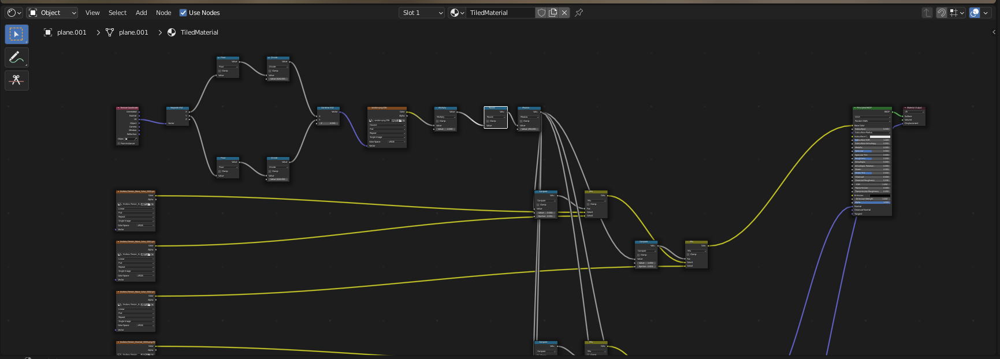

# blender-endless-materials

This is a simple script for Blender that allows to utilize the materials created in Substance Designer using the method shown in the excellent [tutorial](https://www.youtube.com/watch?v=FuPQNIx3dh8) by Roberto de Rose. The tutorial in question uses `BerconTile` plugin for 3ds Max which is not available for Blender, so this script aims to replace the required bits of `BerconTile`'s features.

The basic idea of the method is to create a set of textures that can be tiled with each other by
1. using a fixed random seed for each tile borders (so there are no seams on the border between different textures)
2. using random seeds for each tile interior
3. blending the constant exterior with varying interior for each texture in a pack.

When done right, arbitrarily large surfaces can be covered with the random layouts of these tiles without noticeable repetitions.

## Usage

- generate a set of 'endless' (i.e. pairwise tileable) textures following the [tutorial](https://www.youtube.com/watch?v=FuPQNIx3dh8)
- save the script (`create_endless_material.py`) and the provided random texture (`random.png`) to a convenient location on your PC (of course, you can use your own random texture if you wish)
- for each material you wish to create from your texture sets:
  - edit the paths to your textures in the script by modifying the variables `TILES_BASE_COLOR_PATH`, `TILES_NORMAL_PATH` and `TILES_NORMAL_PATH` (as one can tell from this list, currently supported sets are base color, normals and displacement)
  - edit the path to the random texture you've saved (`RANDOM_TEXTURE_PATH`)
  - edit material name (`RANDOM_TEXTURE_PATH`)
  - edit the max number of tiles used for each set (variable `RANDOM_TEXTURE_PATH`; note that if you set it to `12` or more, Eevee will fail to render your scene in real time due to its limitations, but Cycles works fine for me)
  - if your normal maps are in OpenGL format, change line 11 from `NORMAL_FORMAT = "DX"` to `NORMAL_FORMAT = "OGL"`
  - copy the script contents to Blender's text editor in the `Scripting` workspace and run it
  - go to `Shading` workspace and select the newly created material from the dropdown. The node setup you observe should resemble the picture in the heading.

## Bug reports
The script was tested on versions 2.93 and 3.0, but older releases may work, too. If you encounter any bugs, please open an issue in this repo.

## ToDo
If this script proves useful I'll try to find some time to implement the features in the list below, but if you are planning to make these (or any other useful) modifications by yourself, please don't hesitate to make a PR :)

- [ ] add support for metallic/specular/... maps
- [ ] wrap the script into a Blender add-on so that the settings could be customized via UI